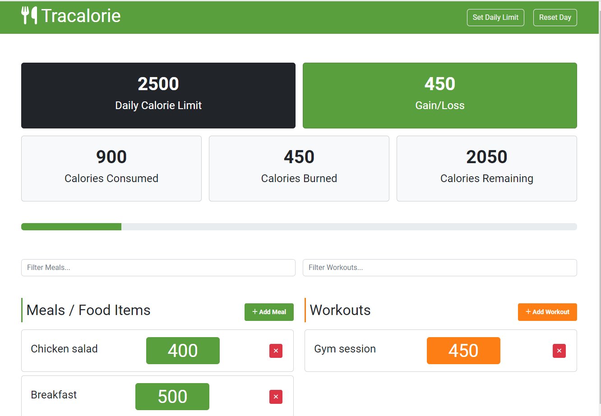

# Tracalorie Vanilla JS Project

App created with the purpose of practicing classes and modules, from Brad Traversy's Modern Javascript Course.
Webpack and Babel were used for bundling the app and Netlify was used to deploy it. The app can be checked at the following link:
https://luxury-faun-195a9e.netlify.app/

Preview:

